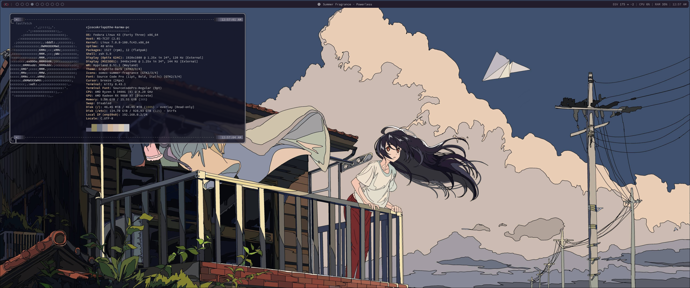

# The Karma OS



## About

This repository contains all of the scripts, dotfiles, and other things for building my Fedora bootc image
that I use on my workstations. It is built off the [ublue image template](https://github.com/ublue-os/image-template) due to the
awesome stuff that it includes to get started. The goal of this image is to provide my preferred setup for using a Linux Desktop.
If someone else that is not me chooses to use this image do be warned that there are some hard coded paths based on what I
always set my username to so make sure to fork and edit those I would love to see how people end up using it if they choose to. :)

## Batteries Included

Below is a list of things that are included in the image. There may be some missing so take a look at [the changelog](./CHANGELOG.md)
for a full history on what's included.

- Window Manager: Hyprland
- Terminal+Shell: Kitty+Zsh
- File Manager: Nautilus
- Lock Screen: Hyprlock
- Status Bar: Waybar
- Systray Widget: Eww
- Terminal Programs
- Applications
    - Discord
    - Steam
    - EmulationStation DE
    - Retroarch
    - Visual Studio Code (Through flatpak script)
    - Zen Browser
    - Spotify (Through flatpak script)
    - Bitwarden Password Manager (Through flatpak script)

## CI Workflows

The image is automatically built on every new commit that does not touch documentation paths. This will let you easily
update to the new image once its built. Every image that is built from a commit is tagged with the tag `commit-XXXXXXX` where the Xs
are replaced with the first seven characters of the commit hash. 

There is a second way the image building workflow is run which is everyday at midnight in EST (however it runs around 2 AM EST for
whatever reason). This ensures nightly builds that will keep the packages up to date. Nightly builds are tagged with `nightly-%Y.%m.%d`.

There is also a workflow that builds the ISO for the image. At the time of writing this the default workflow included in the ublue image
is broken so I have made the fixes for it here and it should create the ISO as a build artifact. I need to contribute those upstream at
some point.

## Installation

### Step 0: Make any changes (Optional)

This first optional step is to make any changes to the image and then push it to the repo. This will trigger the image build workflow
to push an image with the changes. If you plan to use a username other then `cjcocokrisp` you'll need to edit some of the configs
to not use my hard coded username.

### Step 1: Building a disk ISO

This step is kind of optional, you can install any ISO of the image and then just upgrade it after first install. But to build an ISO,
there is a manual workflow that must be run. Once you have an ISO download it from the artifacts on the CI run and then put it on your
USB.

### Step 2: Install the ISO

Next boot into the ISO and install the OS on to your drive. Do be warned, you cannot dual boot with bootc images. I tried some different
ways to try and get it to work and had no luck so make sure it's installed into a fresh drive. 

### Step 3: Boot into the installed OS 

This step is really simple just boot into the OS with the user that you created during installation.

### Step 4: Manual Edits

I could not think of easy ways to automate somethings so here are a list of manual changes that must be made.

- Set GTK theming to `Graphite-Dark` and icons to `oomox-summer-fragrance`
- Set font to `Source Code Pro`
- Sign into Dexcom by editing `~/scripts/dexcom/.env` 
- Edit `/etc/fstab` and comment out the line about the root
- Run `~/scripts/install-flatpaks.sh` to install flatpak apps
- Set btop theme to `tty`
- If on desktop make the edits in [desktop-adjustments.md](./docs/desktop-adjustments.md)

## Upgrades

To upgrade the system the following command just needs to be run.
```
sudo bootc upgrade
```

## Acknowledgements

Below are the links to configs, dotfiles, themes, and more that I used to help make this.

- https://www.pixiv.net/en/artworks/67308965
- https://github.com/vinceliuice/Graphite-gtk-theme
- https://github.com/adi1090x/rofi
- https://github.com/mahaveergurjar/Hyprlock-Dots
